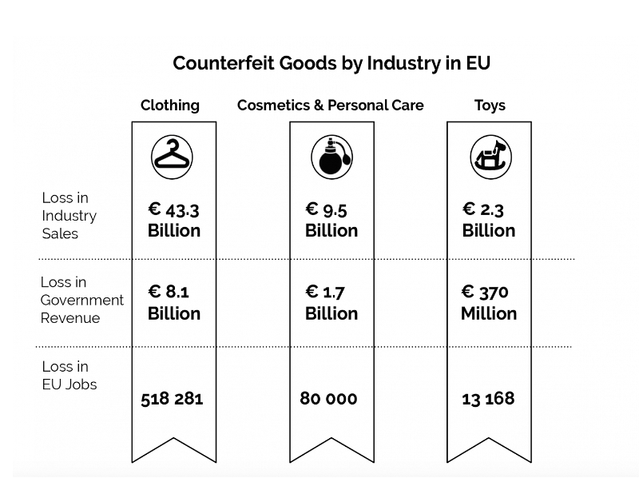

# **Proposals Made in Italy**

## Abstract

Blockchain is a decentralized distributed data structure used to record transactions that are aggregated in blocks across many systems, it has revolutionized the way societies interacts and trades. Crypotocurrencies like bitcoin, etherium etc. run on the technology called blockchain. This paper reviews the use of blockchain in several different fields espically to support made in Italy to certify the provenance and process of a product claimed to be Made in Italy.  (**further points would be added in the abstract section in future**).

## 1. Introduction

When we say *Made in Italy* it is a merchandise mark that indicates that a product is all planned, manufactured and packed in Italy, espically concerning the design, fashion, food, wine, manufacturing, craftsmanship and engineering industries. It is well known and highly regarded label that signifies quality, crafstmanship. It is worth noticing that counterfeit products and unauthorized use of the *"Made in Italy"* mark are unfortunately common. There are those who see the blockchain as the solution to protect the real made in Italy from clones and immitations for sale. As data that is stored on the blockchains are immutable and difficult to delete. Reliability of the data collected on the blockchain makes it's interesting for tracability. For example, over 300 products with quality certifications (DOP, IGP, SGT), more than 500 DOC, DOCG, IGT wines, for a value added in 2021 of 64 billion euros and export value of 50 billion euros; values ​​that, however, pale in comparison to the market value of Italian Sounding, or the improper use of names, logos, and images that emulate Made in Italy, but have nothing Italian about them, a market that, according to Coldiretti and Filiera Italia estimates, is worth more than 100 billion euros [[1]](https://affidaty.io/blog/en/2023/03/blockchain-made-in-italy-2/). 

###  1.1 What is Blockchain ? 
**Blockchain** plays an important role and it can be defined as "an immutable ledger for recording transactions, maintained within a distributed network of mutually untrusted blocks. A blockchain is a list of ordered blocks, where each block stores a variable size list of transactions" [[2]](http://docenti.ing.unipi.it/p.perazzo/research/2019%20-%20BRUSCHETTA_%20An%20IoT%20Blockchain-Based%20Framework%20for%20Certifying%20Extra%20Virgin%20Olive%20Oil%20Supply%20Chain.pdf). A ledger is a computarized record that can store alll the transactions and it is distributed across multiple locations to store the record of the transactions. Somehow, we can say that every distributed ledger represents the kind of Blockchain but vice versa is not true. All blocks are linked according to some semantics(hash values).

Consecutive blocks, which are linked with each other through the hash value of previous block header.
Other than the inevitable cryptographic hash, timestamp, nonce and transaction data are also included in a block. The block timestamp is considered valid only if its value is more than
the network-adjusted time plus two hours and greater than the median timestamp of prior eleven blocks, which prevents adversary to manipulate the blockchain possibly[[5]](https://www.sciencedirect.com/science/article/pii/S0167739X23000493)

<figure markdown>
  { width="500" }
  <figcaption>Fig 1 :- General structure of a blockchain, in which blocks connected with each
other through their respective hash codes [5].
</figcaption>
</figure>

The blockchain is extended by each additional block and hence represents a complete ledger of the transaction history. Blocks can be validated by the network using cryptographic means. In addition to the transactions, each block contains a timestamp, the hash value of the previous block (‘‘parent’’), and a nonce, which is a random number for verifying the hash. This concept ensures the integrity of the entire blockchain through to the first block (‘‘genesis block’’). Hash values
are unique and fraud can be effectively prevented since changes of a block in the chain would immediately change the respective hash value. If the majority of nodes in the network agree by a consensus mechanism on the validity of transactions in a block and on the validity of the block itself, the block can be added to the chain. [[7]](https://link.springer.com/article/10.1007/s12599-017-0467-3)

All transactions are subjected to verification before being appended to the blockchain. Cryptocurrencies operate on this immutable and decentralized technology, making them resistant to counterfeiting and eliminating the need for central authorities, all secured through robust encryption algorithms. Beyond the financial realm, blockchain's widespread adoption is evident as it rapidly advances in various other domains, revolutionizing industries through its ever-evolving potential. For example,

**How Walmart canada uses Blockchain to solve supply-chain challanges**.[[8]](#references)

>At one point in time, customers started returning products to Walmart due to issues with their quality. As a result, Walmart faced a significant increase in return rates and refund requests. Identifying the root cause of these problems within their complex supply chain management proved to be a daunting task. To tackle this challenge, they decided to adopt blockchain technology, which provided a solution to track and trace the product journey effectively, helping them address quality issues and improve their overall operations.

In this regard, blockchain technology plays an important role to certify the provenance and products that claims to be "Made in Italy". Blockchain plays an important role in combating food fraud, italian sounding and allow italian companies to defend the numerous high quality productions that are made in Italy. Even non-fungiable tokens could also play a crucial role that allows a creation of unique tokens to digial assets like images, videos and music. It represents a programmable ownership of certificates for digital products allowing creators and companies to sell their digital products while maintaining complete control over the rights. Now, blockchain technology plays in important roles in wine industry [[3]](https://www.mdpi.com/2071-1050/13/23/13070), food industry [[4]](https://www.mdpi.com/2305-6290/4/4/27) etc. The success of of this technology primarily depends upon transparency, reliability and immuatability. 

In this paper, we are on the best two industries fashion and wine. How blockchain can help "made in Italy", what technologies are actually the most suitable and will help in certify the provinance of the products that are made in Italy. The paper is structured is as follows section 2 is the research methodology section 3-5 is is implementation of these steps in the methodology and in section 6 the conclusion is presented.

## 2. *Methodology*

Our Reaserch methodology is characterized by the following steps [[6]](https://www.sciencedirect.com/science/article/pii/S2351978920306181):- 

1. Data collection
2. Data selection (Inclusion and exclusion criteria, Digital libraries etc.)
3. Report, analysis, discussions, comparisons and conclusions. 

In the first step, we're discussing about collection data from various sources like scientific papers, blogs, surveys, online database, publicly available data, statistical information. Scientific papers are obtained based on certain keywords, citations, document type etc. 

In the second step, that is data selection we are interested describing our selection criteria like what kind of papers or blogs will be included and excluded based on certain criteria (like. period, language of the paper etc.). 

In the third step, we are selected papers are reviewed and then the pros and cons of different blockchains technologies, how it will help "Made in Italy", problems, future developments and conclusions. 

>> Here, I will write more stuffs in the end. First write other things

## 3. *How Blockchain can help made in Italy ?*

Blockchain technology can potentially help the "Made in Italy" initiative in several ways, especially in promoting and protecting the authenticity and quality of Italian products. Having said that, counter piracy and counterfeiting have been the major problem.Counterfeiters can operate in different ways.
They can forge the labels of real products (e.g., falsify expiration dates), develop imitations of
genuine products, or apply real products tags to risks, solidify favorable attitudes, and nudge purchase decisions. For example, Counterfeit Italian goods which, according to OECD surveys, fuel a turnover of **32 billion euros** on the world market, of which approximately 30% is made up of the agri-food and textile-clothing sectors [[10]](https://www.sardegnaimpresa.eu/it/news/made-italy-progetto-blockchain-contrastare-la-contraffazione-sui-mercati-internazionali).

According to one of the OECD report, world trade in counterfeit goods (luxury bags, watches, food products, auto parts) has an impact on the Italian economy of about 1-2% of GDP in terms of sales, while trade in counterfeit and pirated goods in the world amounts to 5% of imports into the EU [[12]](https://www.europol.europa.eu/sites/default/files/documents/counterfeiting_and_piracy_in_the_european_union.pdf).

<figure markdown>
  { width="500" }
  <figcaption>2017 Situation Report on Counterfeiting and Piracy in the EU [13]</figcaption>
</figure>

An Italian startup, IL Mio World at the forefront of the use of this technology, gives an example of how the blockchain can be successfully implemented in the process of brand authentication. IL MIO World, in fact, embeds Near Field Communication (NFC) chips into luxury products, giving products a unique ID that is then connected to data stored on the blockchain. In this way, a digital fingerprint is registered for physical assets. Through the chip, consumers can claim ownership of their products that is provable and verified at any time on the blockchain. They can then ensure that any second-hand products or products bought through third parties or retailers are authentic. On the other hand – in addition to being able to verify the authenticity of their products and fight counterfeit items – brands can develop exclusive engagement campaigns for the owners of their authentic products and, for the first time, they can track second and third hand purchases of their products and incentivize interactions like real-time product feedback surveys, which increases brand loyalty [[13]](#references).

*** 

The utilization of blockchain tracking for Made in Italy products offers several benefits. It enhances the distinctiveness and historical background of these products, safeguarding the brand against counterfeiting and Italian Sounding practices. By leveraging blockchain technology, the authenticity and origin of each product can be verified, reinforcing consumer trust and protecting the reputation of genuine Italian goods in the market.

The advantages Blockchain can offer to made in Italy is immense:-  

* Blockchain, which possesses inherent features that allow secure and unchangeable tracking of transactions within a specific supply chain. By utilizing blockchain, control processes become automated, enabling all participants in the supply chain to simultaneously verify each transaction. This ensures comprehensive oversight of product quality throughout the entire process.

* Blockchain is accessible and shared among all participants in a supply chain, updated with each new transaction, and made instantly available to everyone involved. This real-time accessibility allows all partners to have access to the most up-to-date information, ensuring transparency and collaboration throughout the supply chain.

* Immutability, security and privacy plays a major role, no participants can amend a transaction once it has been registered. If a mistake is made, a new transaction must be carried out to correct it. In this way both transactions remain visible, guaranteeing the existence of a Ground. Truth in the event of any disputes between parties. No unauthorized access to the network is not possible, guaranteeing that participants are actually who they declare
to be [[9]](#references).

* Provenance is defined as information about the creation, chain of custody, modifications or influences pertaining to an artifact. Provenance knowledge comes from supply chain transparency in terms of how products were manufactured, stored, and delivered to customers. Provenance knowledge can increase customers trust by assuring the origin, authenticity, custody,
and integrity of products. Blockchain technology presents potent solutions to enrich customers understanding of the provenance of products. It offers a robust system to trace the origin, certify authenticity, track custody, and verify the integrity of various items. Through blockchain, customers can have increased confidence in the genuineness and reliability of the products they purchase, promoting transparency and trust in the supply chain [[11]](https://www.sciencedirect.com/science/article/pii/S0007681319300084).
 
---
#### 3.1 One of the possible way to implement Blockchain in supply chains(for ex. COFFEE) to gurantee the provenance.

 The successful implementation of blockchain in a supply chain to establish provenance knowledge requires three key considerations. Firstly, all stakeholders in the supply chain must reach a consensus and collaborate to implement the blockchain solution together. For instance, in the context of a coffee supply chain, agreement from coffee farmers, processors, distributors, retailers, and even the coffee brand would be necessary to adapt the required processes for blockchain integration.

Secondly, financial investments are crucial to minimize manual data entry and potential errors. By investing in technologies like IoT sensors, AI-enabled surveillance, and QR codes, the need for human intervention in recording information on the blockchain can be reduced, ensuring data accuracy and integrity.

Lastly, customer awareness and accessibility to the provenance information contained in the blockchain are vital. This might entail product labeling adjustments, marketing campaigns, or the development of a user-friendly smartphone app. *For example, a chocolate manufacturer implementing blockchain in their supply chain might need to create packaging that encourages consumers to scan QR codes for detailed information about the chocolate's journey from bean to bar*. [[11]](#references)

---

Blockchain technology can be a highly useful instrument for italian companies, because it enables them to leverage the quality and excellence of their own production, so that they take on a more prominent role and therefore boost their negotiating power in different value chains. The Ministry of Economic Development, in partnership with IBM, various associations, and relevant companies, initiated a project to evaluate the feasibility of employing blockchain technology for enhancing the traceability and promotion of Made in Italy products. The project aims to explore how blockchain's capabilities can be harnessed to ensure the authenticity and transparency of Italian goods throughout the supply chain, thereby promoting consumer trust and increasing the visibility of Italian products in the global market. what emerged from the project can be summarised as follows [[9]](https://www.mimit.gov.it/images/stories/documenti/IBM-MISE-2019-INGLESE.pdf) :-

* The limited knowledge of Italian companies regarding emerging technologies necessitates the implementation of an appropriate support process. This process aims to facilitate the exchange of experiences and the sharing of best practices among companies. By providing such accompaniment, businesses can gain valuable insights and guidance on how to effectively leverage emerging technologies, including blockchain, to enhance their operations, ensure product traceability, and promote the "Made in Italy" brand globally. This collaborative approach will foster a culture of learning and innovation, enabling Italian companies to stay competitive in a rapidly evolving technological landscape.

* The industry cannot be closed: it is necessary to guarantee inter-operability between different blockchain networks and enable access to all interested parties, by defining suitable operative methods
and opportunities for differentiating various value transactions.

* Data are considered an asset of single companies. Therefore guaranteeing security and privacy is vital in the handling of information, using standards and establishing guidelines on how to
share and transform them into new value.

***
Some of the ways Blockchain can contribute to this cause:-

 * Supply Chain Transparency:- Blockchain can provide transparency throughout the supply chain of Italian products. Each step of the production process, from sourcing raw materials to manufacturing and distribution, can be recorded on the blockchain. This enables consumers to trace the origin of products and verify their authenticity, ensuring that they are genuinely made in Italy [[9]](#references).
 * Smart Contracts for Trade:- Blockchain's smart contracts can facilitate trade agreements between Italian manufacturers and global distributors. These contracts can automate payment terms, shipping conditions, and other terms of the deal, ensuring fair and efficient transactions [[14]](#references).
 * Anti-Counterfeiting Measures:-  Italy is renowned for its high-quality products, which unfortunately makes it a target for counterfeiters. Blockchain can be used to create unique digital certificates for each item, making it difficult to replicate or forge Italian products. Consumers can scan a product's QR code or NFC tag to access its blockchain-based certificate and verifying its authenticity.[[15]](#references)
 * Intellectual Property Protection:- Blockchain can be utilized to record intellectual property rights, such as patents and trademarks, in a secure and immutable manner. This helps Italian businesses protect their innovations, designs, and branding from unauthorized use or infringement.[[16]](#references)
 * Will build consumer Trust and Brand Loyalty :- The transparency and authenticity provided by blockchain technology can build trust among consumers. When they are assured of the genuine origin of Italian products, they are more likely to choose them over other options, leading to increased brand loyalty.

***

## *References*

[1] [Blockchain applied to made in Italy](https://affidaty.io/blog/en/2023/03/blockchain-made-in-italy-2/)

[2] [An IoT Blockchain-Based Framework for Certifying Extra Virgin Olive Oil Supply Chain.In: Proceedings of the 5th IEEE International Conference on Smart Computing 2019: Washington, United States](http://docenti.ing.unipi.it/p.perazzo/research/2019%20-%20BRUSCHETTA_%20An%20IoT%20Blockchain-Based%20Framework%20for%20Certifying%20Extra%20Virgin%20Olive%20Oil%20Supply%20Chain.pdf)

[3] [Blockchain-Based Wine Supply Chain for the Industry Advancement](https://www.mdpi.com/2071-1050/13/23/13070)

[4] [Blockchain Technology in the Food Industry: A Review of Potentials, Challenges and Future Research Directions](https://www.mdpi.com/2305-6290/4/4/27)

[5] [Blockchain for the metaverse: A Review](https://www.sciencedirect.com/science/article/pii/S0167739X23000493)

[6] [Blockchain and agricultural supply chains traceability: research trends and future challenges](https://www.sciencedirect.com/science/article/pii/S2351978920306181)

[7] [Blockchain :- Michael Nofer, Peter Gomber, Oliver Hinz & Dirk Schiereck](https://link.springer.com/article/10.1007/s12599-017-0467-3)

[8] [How Walmart Canada Uses Blockchain to Solve Supply-Chain Challenges](https://hbr.org/2022/01/how-walmart-canada-uses-blockchain-to-solve-supply-chain-challenges)

[9] [PROTECTING MADE IN ITALY WITH BLOCKCHAIN(textile)](https://www.mimit.gov.it/images/stories/documenti/IBM-MISE-2019-INGLESE.pdf)

[10] [Made in Italy, a blockchain project to combat counterfeiting on international markets](https://www.sardegnaimpresa.eu/it/news/made-italy-progetto-blockchain-contrastare-la-contraffazione-sui-mercati-internazionali).

[11] [It’s real, trust me! Establishing supply chain provenance using blockchain](https://www.sciencedirect.com/science/article/pii/S0007681319300084)

[12] [TRADE IN COUNTERFEIT GOODS AND THE ITALIAN ECONOMY](https://www.oecd.org/gov/illicit-trade/Summary-Brochure-Italy-EN.pdf)

[13] [“Il MIO World” the innovative anti-counterfeiting solution that combines Blockchain and NFC.](https://talentgarden.org/en/startup/il-mio-world-armin-zadakbar-2/)

[14] [Smart Contracts in Blockchain Technology: A Critical Review](https://www.mdpi.com/2078-2489/14/2/117)

[15] [Exploring blockchain-supported authentication based on online and offline business in organic agricultural supply chain](https://www.sciencedirect.com/science/article/pii/S0360835222007264)

[16] [AI & Blockchain with reference to Intellectual Property Rights(Linkedin)](https://www.linkedin.com/pulse/ai-blockchain-reference-intellectual-property-rights-prity-khastgir/).