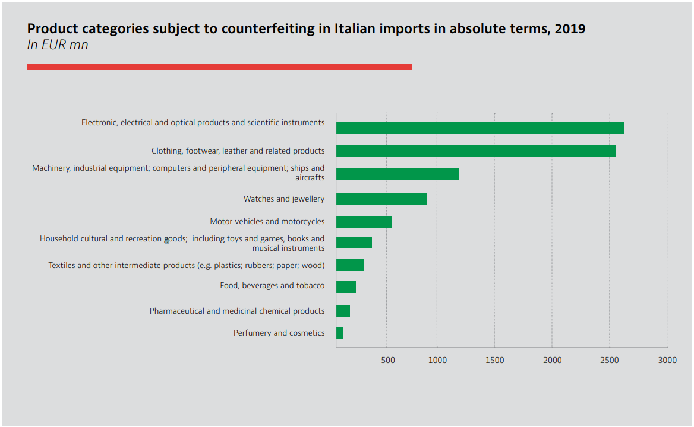

# **Proposals Made in Italy**

## Abstract

Blockchain functions as a decentralized and distributed data structure that captures transactions within blocks across numerous systems. It's impact on societal interactions and trade has been transformative. This paper assesses blockchain's applications in diverse domains, particularly its role in bolstering the authenticity of "Made in Italy" products. This is crucial due to the detrimental effects of counterfeiting on Italian products global image and revenue. Blockchain emerges as a pivotal tool in ensuring product provenance, particularly within supply chain management, as its immutable data structure safeguards against tampering. Utilizing traceability solutions based on blockchain can effectively address the limitations associated with centralized traceability systems. This paper also delves into various blockchain technologies, discussing their merits, drawbacks and challenges and identifies the most suitable options and role of Web3, Smart contracts, NFTs in "Made in Italy". Moreover, it emphasizes present cases in which certain enterprises have utilized blockchain technology to confirm the origin, excellence, genuineness of products, and facilitate the monitoring of processes in supply chain management. 

## 1. Introduction

The phrase "Made in Italy" serves as a label denoting that a product is entirely conceived, produced, and packaged within Italy, particularly in relation to sectors such as design, food, fashion, cuisine, wine, manufacturing, skilled craftsmanship, and engineering. It is well known and highly regarded label that signifies quality and crafstmanship and used to convey that the product has been designed, manufactured and packaged within Italy, showcasing the country's expertise and reputation in various industries  [[1]](https://www.100ita.com/page.php?p=aboutus/made_in_italy).

It is worth noticing that counterfeit products and unauthorized use of the *"Made in Italy"* mark are unfortunately common. There are those who see the blockchain as the solution to protect the real "made in Italy" from clones and immitations for sale. As data that is stored on the blockchains are immutable and difficult to delete. Reliability of the data collected on the blockchain makes it's interesting for tracability. For example, in sectors like agri-food production, where there are over 300 products holding quality certifications like *DOP (Denominazione di Origine Protetta)*, *IGP (Indicazione Geografica Protetta)*, as well as more than 500 *DOC(Denominazione di Origine Controllata)*, *DOCG(Denominazione di Origine Controllata e Garantita)*, *IGT(Indicazione Geografica Tipica
)* wines. These products contributed a value added of 64 billion euros and export value of 50 billion euros in 2021. However, these figures are overshadowed by the market value of what's known as "Italian Sounding" – the unauthorized usage of names, logos, and images that mimic *"Made in Italy"* but lack any genuine Italian connection. This shadow market, estimated at over 100 billion euros by Coldiretti and Filiera Italia, demonstrates the profound impact of counterfeiting. Herein lies the importance of blockchain technology. It has the potential to be a pivotal tool in the fight against fraud, offering Italian companies a means to safeguard their diverse portfolio of high-quality products that constitute Italy's rich culinary heritage [[2]](https://affidaty.io/blog/en/2023/03/blockchain-made-in-italy-2/). 

This paper explores the rationale behind the adoption of blockchain technology, specifically focusing on its potential benefits for the "Made in Italy" initiative. It delves into the selection of blockchain as a solution and how it can contribute to enhancing the authenticity and traceability of Italian products. The study identifies the most suitable technologies among multiple that can effectively certify the origin of these products, evaluating their advantages and disadvantages. Furthermore, the paper examines real-world instances where businesses have already embraced blockchain to track and ensure the genuineness of their products.

###  1.1 What is Blockchain ? 
**Blockchain** plays an important role and it can be defined as "an immutable ledger for recording transactions, maintained within a distributed network of mutually untrusted blocks. A blockchain is a list of ordered blocks, where each block stores a variable size list of transactions" [[3]](http://docenti.ing.unipi.it/p.perazzo/research/2019%20-%20BRUSCHETTA_%20An%20IoT%20Blockchain-Based%20Framework%20for%20Certifying%20Extra%20Virgin%20Olive%20Oil%20Supply%20Chain.pdf). A ledger is a computarized record that can store alll the transactions and it is distributed across multiple locations to store the record of the transactions. Somehow, we can say that every distributed ledger represents the kind of Blockchain but vice versa is not true. All blocks are linked according to some semantics.

Successive segments of the blockchain are interlocked using the cryptographic hash of the preceding block's header. These blocks maintain a sequential chain due to this cryptographic linkage. Apart from the essential cryptographic hash, each block's header comprises a timestamp, nonce, and transaction information. The timestamp in a block is acknowledged as legitimate only if it surpasses the network's adjusted time by over two hours and exceeds the median timestamp of the previous eleven blocks. This safeguard thwarts potential adversaries from tampering with the blockchain's integrity [[4]](https://www.sciencedirect.com/science/article/pii/S0167739X23000493).

<figure markdown>
  { width="500" }
  <figcaption>Fig 1 :- General structure of a blockchain, in which blocks connected with each
other through their respective hash codes [4].
</figcaption>
</figure>

With the addition of each new block, the blockchain expands and serves as a comprehensive ledger documenting transaction histories. Through cryptographic methods, the network can authenticate these blocks. Alongside the transaction records, each block incorporates a timestamp, the cryptographic hash of the preceding block (referred to as the "parent" block), and a nonce—a random number that's used to verify the hash. This framework guarantees the integrity of the entire blockchain, including the initial "genesis block." The uniqueness of hash values makes it exceedingly challenging for fraudulent activities to occur, as any alterations to a block would instantaneously alter its corresponding hash value. When a consensus is reached among the majority of network nodes regarding both the legitimacy of transactions within a block and the block itself, it becomes eligible for inclusion in the blockchain [[5]](https://link.springer.com/article/10.1007/s12599-017-0467-3).

All transactions are subjected to verification before being appended to the blockchain. Cryptocurrencies operate on this immutable and decentralized technology, making them resistant to counterfeiting and eliminating the need for central authorities, all secured through robust encryption algorithms. Beyond the financial realm, blockchain's widespread adoption is evident as it rapidly advances in various other domains, revolutionizing industries through its ever-evolving potential. For example,

***
### 1.1 How FORD(an automobile manufacturer) uses blockchain to ensure authenticity :- [[6]](https://www.blockdata.tech/profiles/ford-blockchain).

In January 2019, Ford Motor Company launched a blockchain pilot with IBM to ethically source cobalt. They use **Hyperledger Fabric** to demonstrate responsible production, trade, and processing in the supply chain. The goal is to create an open industry-wide network for tracing and validating minerals and materials used in automotive and consumer electronics. By leveraging blockchain technology, they aim to replace traditional third-party audits with a network of validated participants and real-time accessible immutable data. In late January 2020, Ford and IBM further collaborated to use blockchain for tracing cobalt's source to ensure authenticity and quality for electric car batteries. They are using blockchain technology for tracing the source of cobalt, a crucial component in electric car batteries. The main objective was to ensure the authenticity and quality of the cobalt supplies used by Ford. 

***

### 1.2 Importance of Blockchain :-

In this regard, blockchain technology plays an important role to certify the provenance and products that claims to be "Made in Italy". Blockchain plays an important role in combating food fraud, italian sounding and allow italian companies to defend the numerous high quality productions that are made in Italy. Even non-fungiable tokens could also play a crucial role that allows a creation of unique tokens to digial assets like images, videos and music. It represents a programmable ownership of certificates for digital products allowing creators and companies to sell their digital products while maintaining complete control over the rights. Now, blockchain technology plays in important roles in wine industry [[7]](https://www.mdpi.com/2071-1050/13/23/13070), food industry [[8]](https://www.mdpi.com/2305-6290/4/4/27) etc. The success of of this technology primarily depends upon transparency, reliability and immuatability. 

## 2. *Methodology*

Our research methodology is characterized by the four steps [[9]](https://www.sciencedirect.com/science/article/pii/S2215016122002746):- 

1. Data collection and analysis
2. Data Library sources 
3. Inclusion and exclusion criteria
4. Discussion

### 2.1 Data collection and analysis

The initiation of this study involves a meticulous gathering of scientific papers using a predefined set of specific keywords. These keywords, including terms like "Made in Italy," "Blockchain," "Hyperledger Fabric," and "Supply Chain Management" etc. are employed to locate pertinent papers encompassing articles, blogs, and reports. Following the search based on these keywords, I am proceeding to explore official websites associated with various blockchain technologies, along with pertinent blogs and articles relevant to supply chain management particularly "Made in Italy".

This process is enabling me to access firsthand information from primary sources and acquire insights directly from developers and field experts. By navigating through these authoritative resources, my intention is to deepen the comprehension of the most recent advancements, real-world applications, and emerging trends within the domains of blockchain technology and supply chain management.

### 2.2 Data sources

For this study, I am extensively utilizing a diverse array of data sources to gather comprehensive insights. I'm exploring various avenues, including renowned academic platforms such as the **IEEE Digital Library**, **ScienceDirect**, **Springer Link** and **MDPI**. These platforms offer access to peer-reviewed research articles and scholarly publications, ensuring a solid foundation for my analysis. In addition, I'm exploring official websites of blockchain technologies to gain firsthand information from the developers themselves.

To capture industry perspectives and practical applications, I'm engaging with **blogs**, **articles**, **reports** even **LinkedIn posts** by **experts** in the field. These sources provide valuable insights into real-world experiences and emerging trends. Moreover, I'm exploring **official websites** of organizations like The European Blockchain Services Infrastructure (EBSI), which represents a network of distributed blockchain nodes across Europe.

To contextualize my study, I'm accessing government resources such as the Ministry of Business and "Made in Italy" (mimit.gov.it), which shed light on policy perspectives and initiatives. By meticulously examining this diverse array of data sources, I am presenting a comprehensive analysis that bridges academic research, practical industry insights, and policy considerations. This multifaceted approach enhances the depth and breadth of my study, enabling a well-rounded understanding of the dynamic landscape of blockchain technology and supply chain management.

### 2.3 Inclusion and exclusion criteria

| Criteria Type       | Description   | Example|
| :---------: | :----------------------------------: | :---------: |
| Period |  Articles have been chosen for evaluation according to specific timeframes as blockchain technology is continously evolving and expanding. | **INCLUSION** :- From 2017 to 2023, **EXCLUSION** :- Papers prior  2017 |  |
| Type of sources | Articles have been added to or removed from consideration based on their source type | **INCLUSION** :- Articles from scientific papers, official websites, blogs(italian/english), posts, reports, newsletters.          **EXCLUSION** :- Articles from books, Information from videos. |
| Languange |Articles have been excluded based on language |  **EXCLUSION** :- Conference/Journal papers that are not in English|

### 2.4 Discussion

In the following sections, we'll explore why we are using blockchain, how blockchain can revolutionize *"Made in Italy*." We'll see real use cases in sectors like wine and fashion, highlighting how blockchain ensures authenticity and traceability. Our analysis will encompass diverse blockchain technologies like Hyperledger Fabric, Green Blockchain, Corda, IBSI, and EBSI, evaluating their pros and cons. We'll pinpoint the most suitable technology for "Made in Italy," enabling reliable certification, supply chain tracking, and anti-counterfeiting measures. Through practical examples, we'll illustrate how these advancements benefit industries, preserving their integrity and enhancing the global reputation of "Made in Italy."

## 3. *How Blockchain can help made in Italy ?*

Blockchain technology can potentially help the "Made in Italy" initiative in several ways, especially in promoting and protecting the authenticity and quality of Italian products. Having said that, counter piracy and counterfeiting have been the major problem.Counterfeiters employ diverse strategies to carry out their illicit activities. These tactics encompass forging legitimate product labels, which might involve falsifying expiration dates, creating replicas of authentic products, or affixing genuine product tags onto counterfeit items. For example, Counterfeit Italian goods which, according to OECD surveys, fuel a turnover of **32 billion euros** on the world market, of which approximately 30% is made up of the agri-food and textile-clothing sectors [[10]](https://www.sardegnaimpresa.eu/it/news/made-italy-progetto-blockchain-contrastare-la-contraffazione-sui-mercati-internazionali).

According to one of the OECD(Organisation for Economic Co-operation and Development) report, world trade in counterfeit goods (luxury bags, watches, food products, auto parts) has an impact on the Italian economy of about 1-2% of GDP in terms of sales, while trade in counterfeit and pirated goods in the world amounts to 5% of imports into the EU [[11]](https://www.oecd.org/gov/illicit-trade/Summary-Brochure-Italy-EN.pdf).

<figure markdown>
  { width="800" }
  <figcaption>Fig 2:- Counterfeiters heavily targeted various sectors in Italy [11]
  </figcaption>
</figure>

An Italian startup, IL Mio World at the forefront of the use of this technology, gives an example of how the blockchain can be successfully implemented in the process of brand authentication. IL MIO World, in fact, embeds Near Field Communication (NFC) chips into luxury products, giving products a unique ID that is then connected to data stored on the blockchain. In this way, a digital fingerprint is registered for physical assets. Through the chip, consumers can claim ownership of their products that is provable and verified at any time on the blockchain. They can then ensure that any second-hand products or products bought through third parties or retailers are authentic. On the other hand – in addition to being able to **verify the authenticity of their products and fight counterfeit items** – brands can develop exclusive engagement campaigns for the owners of their authentic products and, for the first time, they can track second and third hand purchases of their products and incentivize interactions like real-time product feedback surveys, which increases brand loyalty [[12]](https://talentgarden.org/en/startup/il-mio-world-armin-zadakbar-2/).

*** 
#### 3.1 Blockchain Empowering Italian Companies: Enhancing Traceability and Promoting Made in Italy Products [[13]](https://www.mimit.gov.it/images/stories/documenti/IBM-MISE-2019-INGLESE.pdf)

Blockchain technology can be a highly useful instrument for italian companies, because it enables them to leverage the quality and excellence of their own production, so that they take on a more prominent role and therefore boost their negotiating power in different value chains. The Ministry of Economic Development, in partnership with IBM, various associations, and relevant companies, initiated a project to evaluate the feasibility of employing blockchain technology for enhancing the traceability and promotion of Made in Italy products. The project aims to explore how blockchain's capabilities can be harnessed to ensure the authenticity and transparency of Italian goods throughout the supply chain, thereby promoting consumer trust and increasing the visibility of Italian products in the global market. what emerged from the project can be summarised as follows [[13]](https://www.mimit.gov.it/images/stories/documenti/IBM-MISE-2019-INGLESE.pdf) :-

* The limited knowledge of Italian companies regarding emerging technologies necessitates the implementation of an appropriate support process. This process aims to facilitate the exchange of experiences and the sharing of best practices among companies. By providing such accompaniment, businesses can gain valuable insights and guidance on how to effectively leverage emerging technologies, including blockchain, to enhance their operations, ensure product traceability, and promote the "Made in Italy" brand globally. This collaborative approach will foster a culture of learning and innovation, enabling Italian companies to stay competitive in a rapidly evolving technological landscape.

* The industry cannot be closed: it is necessary to guarantee inter-operability between different blockchain networks and enable access to all interested parties, by defining suitable operative methods
and opportunities for differentiating various value transactions.

* Data are considered an asset of single companies. Therefore guaranteeing security and privacy is vital in the handling of information, using standards and establishing guidelines on how to
share and transform them into new value.

***

The utilization of blockchain tracking for "Made in Italy" products offers several benefits. It enhances the distinctiveness and historical background of these products, safeguarding the brand against counterfeiting and Italian Sounding practices. By leveraging blockchain technology, the authenticity and origin of each product can be verified, reinforcing consumer trust and protecting the reputation of genuine Italian goods in the market.

**The advantages Blockchain can offer to "Made in Italy" is immense** :-  

* Immutability, security and privacy plays a major role, no participants can amend a transaction once it has been registered. If a mistake is made, a new transaction must be carried out to correct it. In this way both transactions remain visible, guaranteeing the existence of a Ground. Truth in the event of any disputes between parties. No unauthorized access to the network is not possible, guaranteeing that participants are actually who they declare
to be [[13]](https://www.mimit.gov.it/images/stories/documenti/IBM-MISE-2019-INGLESE.pdf).

* Blockchain, which possesses inherent features that allow secure and unchangeable tracking of transactions within a specific supply chain. By utilizing blockchain, control processes become automated, enabling all participants in the supply chain to simultaneously verify each transaction. This ensures comprehensive oversight of product quality throughout the entire process.

* Provenance denotes the information surrounding the origin, custody, alterations, and influences related to an object. This understanding stems from transparent supply chains detailing manufacturing, storage, and delivery processes. Such provenance knowledge enhances customer trust by confirming product authenticity, source, custody, and integrity. Blockchain technology emerges as a robust solution to amplify comprehension of product provenance. Blockchain offers a potent avenue to bolster customer understanding of product lineage. It establishes a resilient framework to trace origins, validate authenticity, track custody, and ensure item integrity. Through blockchain, customers can confidently trust the legitimacy and consistency of their purchases, promoting transparency and trust within supply chains [[14]](https://www.sciencedirect.com/science/article/pii/S0007681319300084).

* Blockchain is accessible and shared among all participants in a supply chain, updated with each new transaction, and made instantly available to everyone involved. This real-time accessibility allows all partners to have access to the most up-to-date information, ensuring transparency and collaboration throughout the supply chain.

 
---

#### 3.2 How to implement it? [[14]](https://www.sciencedirect.com/science/article/pii/S0007681319300084) :- 

Let's consider **Coffee** for example and **one of the possible ways to implement it in blockchain**. The successful implementation of blockchain in a supply chain to establish provenance knowledge requires three key considerations. Firstly, all stakeholders in the supply chain must reach a consensus and collaborate to implement the blockchain solution together. For instance, in the context of a coffee supply chain, agreement from coffee farmers, processors, distributors, retailers, and even the coffee brand would be necessary to adapt the required processes for blockchain integration.

Secondly, financial investments are crucial to minimize manual data entry and potential errors. By investing in technologies like IoT sensors, AI-enabled surveillance, and QR codes, the need for human intervention in recording information on the blockchain can be reduced, ensuring data accuracy and integrity.

Lastly, customer awareness and accessibility to the provenance information contained in the blockchain are vital. This might entail product labeling adjustments, marketing campaigns, or the development of a user-friendly smartphone app. *For example, a chocolate manufacturer implementing blockchain in their supply chain might need to create packaging that encourages consumers to scan QR codes for detailed information about the chocolate's journey from bean to bar*.

---

#### 3.2 Some of the ways Blockchain can contribute to this cause:-

 * Supply Chain Transparency:- Blockchain can provide transparency throughout the supply chain of Italian products. Each step of the production process, from sourcing raw materials to manufacturing and distribution, can be recorded on the blockchain. This enables consumers to trace the origin of products and verify their authenticity, ensuring that they are genuinely made in Italy [[14]](https://www.sciencedirect.com/science/article/pii/S0007681319300084).

 * **Smart Contracts** for Trade:- Blockchain's smart contracts can facilitate trade agreements between Italian manufacturers and global distributors. These contracts can automate payment terms, shipping conditions, and other terms of the deal, ensuring fair and efficient transactions. Entities within a supply chain frequently utilize smart contracts, facilitating not only the streamlined implementation of stipulated terms and conditions through a universally trusted system among all contract participants, but also enabling involved parties to confirm the consensus on matters like stocking, alterations, or product distribution. The ability to track activities contributes to ensuring custody by meticulously documenting every decision and adjustment at each phase of the product's lifecycle [[14]](https://www.sciencedirect.com/science/article/pii/S0007681319300084).
 * Anti-Counterfeiting Measures:-  Italy is renowned for its high-quality products, which unfortunately makes it a target for counterfeiters. Blockchain can be used to create unique digital certificates for each item, making it difficult to replicate or forge Italian products. Consumers can scan a product's QR code or NFC tag to access its blockchain-based certificate and verifying its authenticity [[15]](https://www.sciencedirect.com/science/article/pii/S0360835222007264).
 * Intellectual Property Protection:- Blockchain can be utilized to record intellectual property rights, such as patents and trademarks, in a secure and immutable manner. This helps Italian businesses protect their innovations, designs, and branding from unauthorized use or infringement [[16]](https://www.linkedin.com/pulse/ai-blockchain-reference-intellectual-property-rights-prity-khastgir).
 * Will build consumer Trust and Brand Loyalty :- The transparency and authenticity provided by blockchain technology can build trust among consumers. When they are assured of the genuine origin of Italian products, they are more likely to choose them over other options, leading to increased brand loyalty.

***

#### 3.3  TrackIT Blockchain Project by the Italian Trade and Investment Agency (ICE)
The TrackIT blockchain project aims to enhance the distinct Italian character of products abroad. This initiative enables Italian exporting companies in the **agri-food**, **fashion system**, **cosmetics**, and **furniture/design** sectors to trace their production chains through blockchain, all free of charge. By utilizing blockchain tracking, companies can easily and transparently communicate the history of their products, instilling trust and confidence in the final consumers. Moreover, the project helps combat counterfeiting and protect against **Italian Sounding**, safeguarding the authenticity of genuine Italian goods. Additionally, it empowers companies to showcase their commitment to sustainability, allowing them to share the stories behind their products and demonstrate their dedication to responsible practices. Embracing the TrackIT blockchain project provides Italian businesses with a competitive advantage on foreign markets, reaffirming the authenticity and value of their products while fostering stronger connections with international consumers [[17]](https://www.ice.it/it/blockchain).

The project's primary objective is to register data related to Made in Italy products or production chains on the blockchain. This registration allows consumers to access reliable information about the product's history and the company's background by scanning a dedicated QR code on a web page dedicated to production steps. To ensure the success of TrackIT blockchain, it collaborates with qualified service providers, offering a range of benefits. These include specialized consultancy for mapping supply chains, managing and maintaining the blockchain traceability system, designing and developing programming interfaces (APIs), and creating a user-friendly interface for foreign consumers [[18]](https://www.ilsole24ore.com/art/trackit-blockchain-nasce-progetto-agenzia-ice-tutela-made-italy-AEZME3yB).

By providing transparent and verifiable information through blockchain, TrackIT aims to bolster consumer confidence, combat counterfeiting, and promote the genuine Italian identity of products, giving a competitive edge to participating SMEs in international markets.

***The TrackIT blockchain in Italy uses a private blockchain. A private blockchain is a blockchain that is permissioned, meaning that only authorized users can participate in the network. This makes it a more secure and private blockchain than a public blockchain, which is open to anyone***.

********

#### 3.4 FederItaly :- A Digital Certificate for Authentic Italian Products that uses Blockchain:- [[19]](https://medium.com/@ORIGYN-Foundation/tradition-meets-innovation-a-digital-certificate-for-authentic-italian-products-7f61c98e5687)

As, we discussed the proliferation of counterfeit "Italian" goods has become a growing issue, with the global market for such products estimated to exceed €100 billion. Despite enjoying protected status and regulatory measures, some renowned Italian products like Parmigiano Reggiano face the threat of counterfeiting. This illicit market for counterfeit products, including the imitation of Parmigiano Reggiano, has surged to a staggering value of $2 billion. This figure comes alarmingly close to the legitimate sales revenue of authentic Parmigiano, which stands at approximately $2.7 billion.
FederItaly has formed a strategic alliance with the ORIGYN Foundation, a Swiss nonprofit organization utilizing advanced blockchain technology to establish the legitimacy, identity, and ownership of valuable assets via digital certificates. This collaboration is designed to combat the menace of counterfeit goods and safeguard both Italian brands and consumers. Leveraging the Internet Computer blockchain, ORIGYN's cutting-edge solution guarantees both transparency and security.

Under this partnership, the "FederItaly 100% Made In Italy" emblem will function as a trusted hallmark of authenticity and excellence. Companies seeking this distinction will undergo a rigorous validation procedure. Once approved, a digital certificate containing vital product particulars will be securely stored on the blockchain, accessible through a QR code scan. The ORIGYN Foundation is enthusiastic about its role in preserving Italy's finest products and creative outputs, thereby fostering increased confidence among consumers and brands alike. [[19]](https://medium.com/@ORIGYN-Foundation/tradition-meets-innovation-a-digital-certificate-for-authentic-italian-products-7f61c98e5687).

*** 

*These instances, advantages, possible ways to implement it(ofcourse by taking into account other challanges) vividly underscore the impactful role of blockchain in certifying product provenance, enabling robust tracking mechanisms, and fortifying defenses against counterfeiting. Currently, enterprises are harnessing blockchain in various ways to achieve these objectives as we've seen. Moreover, blockchain is being leveraged to create tamper-proof product histories. Manufacturers and distributors can encode critical information onto the blockchain, allowing consumers to verify a product's origin, journey, and authenticity through a simple scan of a QR code. In essence, enterprises are embracing blockchain to establish a solid foundation of trust, traceability, and authenticity within their operations, ensuring that consumers can confidently access accurate information about the products they purchase while safeguarding against counterfeit threats*.

## 4. Technologies based on blockchain technology.

So, here are some technologies based on blockchain technology :-

#### 4.1 Hyperledger Fabric

Hyperledger Fabric is an open source enterprise-grade permissioned distributed ledger technology (DLT) platform, designed for use in enterprise contexts, that delivers some key differentiating capabilities over other popular distributed ledger or blockchain platforms. One key point of differentiation is that Hyperledger was established under the Linux Foundation, which itself has a long and very successful history of nurturing open source projects under open governance that grow strong sustaining communities and thriving ecosystems. Hyperledger is governed by a diverse technical steering committee, and the Hyperledger Fabric project by a diverse set of maintainers from multiple organizations. It has a development community that has grown to over 35 organizations and nearly 200 developers since its earliest commits. Fabric has a highly modular and configurable architecture, enabling innovation, versatility and optimization for a broad range of industry use cases including banking, finance, insurance, healthcare, human resources, supply chain and even digital music delivery [[20]](https://hyperledger-fabric.readthedocs.io/en/release-2.5/whatis.html).

Fabric, as a sub-project within the Hyperledger ecosystem, provides a versatile distributed ledger technology suited for diverse industrial applications. Its value is derived from several critical pillars. Firstly, Fabric operates as a permissioned blockchain, allowing controlled access and fostering trust among participants. Secondly, it employs chaincode, also known as smart contracts, enabling automated transactions and business logic implementation. Thirdly, its modular architecture offers flexibility, allowing developers to customize and optimize the network. Lastly, Fabric relies on Certificate Authorities (CAs) for identity management, enhancing security and privacy for participants. These pillars collectively make Fabric a valuable and robust solution across blockchain platforms [[21]](https://ieeexplore.ieee.org/abstract/document/10171380).

Pros and Cons of Hyperledger fabric when it comes to Made in Italy [[22]](https://www.devteam.space/blog/pros-and-cons-of-hyperledger-fabric-for-blockchain-networks/) :-

| Pros       | Cons                          |
| :---------: | :----------------------------------: |
| Enhanced Traceability: Hyperledger Fabric enables the recording of every step in the production and supply chain of Made in Italy products. This enhanced traceability allows consumers to verify the origin and authenticity of the products, fostering trust and confidence in the Italian brand.         | Implementation Complexity: Deploying and managing a Hyperledger Fabric network requires technical expertise, which might pose a challenge for some Italian companies with limited resources or technical knowledge. |
|Anti-Counterfeiting Measures: With its permissioned blockchain model, Hyperledger Fabric can help prevent counterfeit products from infiltrating the supply chain. This feature safeguards the reputation of genuine Made in Italy goods and protects consumers from fraudulent imitations.          | Initial Investment: Integrating Hyperledger Fabric involves initial investments in infrastructure, development, and training. For smaller companies, the cost of adoption might be a barrier to entry. |
| Supply Chain Efficiency: The use of blockchain technology in the supply chain can improve transparency and efficiency, reducing delays and enhancing collaboration between different stakeholders. This optimization benefits Made in Italy products by streamlining the production and distribution processes. | Governance and Coordination: In a consortium blockchain involving multiple companies, governance and decision-making might require coordination and agreement on network rules and protocols.|

#### 4.2 Green Blockchain 

According to Digiconomist, a well-known energy consumption index, the carbon footprints of cryptocurrencies like Bitcoin and other digital currencies are comparable to those of entire countries. This high energy consumption is primarily due to the process of mining, which involves facilitating nodes on a peer-to-peer network to reach consensus and update the shared ledger. The profitability of mining cryptocurrencies is heavily dependent on energy costs. As a result, miners often seek out the cheapest energy sources, which unfortunately are often fossil fuels. However, over the years, significant innovations have taken place in the blockchain industry, leading to the development of 100% green blockchains and eco-friendly cryptocurrencies. These new solutions aim to minimize energy consumption and reduce carbon footprints associated with digital currencies. By harnessing renewable energy sources such as solar, wind, hydro, or geothermal power, these eco-friendly blockchains strive to mitigate environmental impacts while continuing to provide secure and decentralized services. With these advancements, the blockchain industry can potentially pave the way for a more sustainable and environmentally conscious future. By embracing eco-friendly technologies, we can help address the energy-intensive nature of cryptocurrencies and reduce their environmental impact significantly [[23]](https://casper.network/en-us/web3/blockchain/green-blockchain/).

*A ***"green blockchain"*** refers to a blockchain network or platform that is designed and operated with a strong focus on environmental sustainability and energy efficiency. The term is often used to describe blockchain systems that minimize their carbon footprint and reduce energy consumption, particularly in comparison to traditional blockchain networks like Bitcoin's Proof of Work (PoW) protocol [[24]](https://www.newsbtc.com/news/company/what-is-green-blockchain-and-why-are-they-important/).*

Pros and Cons of Green blockchain when it comes to Made in Italy :-

| Pros       | Cons                          |
| :---------: | :----------------------------------: |
| Environmental Sustainability: The most significant advantage of green blockchains is their reduced carbon footprint and lower energy consumption. By utilizing renewable energy sources and energy-efficient consensus mechanisms, these blockchains contribute to environmental sustainability and help combat climate change.            | Limited Adoption and Network Security: Green blockchains might face challenges in gaining widespread adoption, as they may not be as well-known or established as traditional energy-intensive blockchains like Bitcoin. Lower adoption can also lead to reduced network security, as fewer nodes may be participating in the consensus process.  |
|Positive Reputation: Green blockchains can attract environmentally conscious users and businesses who prefer platforms that align with their values. This can lead to a positive public image and potentially attract more adoption and investment.             | Technological Complexity: Implementing green blockchain solutions can require complex technological changes, and transitioning from existing energy-intensive blockchains might not always be straightforward. |
| Lower Costs: Green blockchains can offer cost advantages, particularly in regions where renewable energy sources are abundant and cheaper than traditional fossil fuels. This cost efficiency can make them more competitive and appealing to users and businesses.            | Energy Source Dependence: The effectiveness of a green blockchain's environmental impact depends on the availability and stability of renewable energy sources(for ex:- Solar, Bioenergy, Biofuel, Hydroelectricity etc. ). If renewable energy is not consistently available, the blockchain's sustainability goals may not be fully realized. |

#### 4.3 European Blockchain Services Infrastructure(EBSI)
The European Blockchain Services Infrastructure (EBSI) is a pan-European initiative that aims to use blockchain technology to create cross-border public services. It is used to improve the efficiency and transparency of public services: EBSI can be used to create a more efficient and transparent way to deliver public services. For example, EBSI could be used to track the movement of goods across borders, or to verify the authenticity of diplomas. Increase trust in public institutions: EBSI can be used to increase trust in public institutions. For example, EBSI could be used to create a tamper-proof record of government decisions, or to provide citizens with a secure way to access their government services. Promote innovation: EBSI can be used to promote innovation in the public sector. For example, EBSI could be used to create new ways to deliver social services, or to improve the way that governments interact with businesses [[25]](https://ec.europa.eu/digital-building-blocks/wikis/display/EBSI/What+is+ebsi).

The project seeks to foster interoperability and collaboration between various EU member states, enabling them to share and access data securely while ensuring data privacy and protection. EBSI aims to establish itself in ‘virtually’ every public sector domain that can benefit from blockchain technology. It will be materialized as a network o distributed nodes across Europe,
leveraging an increasing number of applications focused on
specific use cases. These use cases are identified and selected each year by the
Member States (European Blockchain Partnership) and the
European Commission [[26]](https://www.itu.int/en/ITU-T/webinars/20201104/Documents/Emilio%20Davila-EBSI%20presentation%20ITU%20ED%2004112020.pdf?csf=1&e=CAHb8b).

Pros and Cons of European Blockchain Services Infrastructure when it comes to Made in Italy  :-

| Pros       | Cons                          |
| :---------: | :----------------------------------: |
| Transparency and immutability: Blockchain technology offers a decentralized and tamper-resistant ledger, ensuring transparency and immutability of data. This can be beneficial for various applications, such as supply chain management, intellectual property protection, and public recordkeeping. | Scalability: Some blockchain networks may face scalability issues, especially when handling a large number of transactions, leading to potential delays and higher costs.
|  Security: Blockchain's cryptographic principles provide a high level of security, making it challenging for unauthorized parties to alter or manipulate the stored data.       | Regulatory challenges: The legal and regulatory frameworks surrounding blockchain and cryptocurrencies can be complex and vary from country to country, potentially creating obstacles for widespread adoption. |
|Cross-border interoperability: A European blockchain infrastructure like EBSI could potentially facilitate cross-border transactions and collaboration, enabling seamless interactions between businesses and governments across member states.  | Interoperability issues: Different blockchain networks may not be fully interoperable, which can hinder the seamless exchange of data and value across different platforms.|

#### 4.4 Corda Blockchain

Corda is a distributed ledger technology (DLT) designed for financial institutions and other industries. It enables the development of decentralized applications known as CorDapps, which incorporate distributed ledger functionalities into specific systems such as supply chain, healthcare, stock markets, and insurance. Corda's architecture operates on a need-to-know basis, ensuring transaction privacy. When two parties (Party A and Party B) conduct a transaction and it is verified by the Notary, the transaction becomes an immutable record on both parties' separate databases. Only the involved parties have access to this immutable record. In Corda, a **"State"** represents an immutable object that represents a fact known by one or multiple parties at a specific time. It can hold various types of data, such as stock, loans, emails, addresses, etc. **"Transactions"** in Corda refer to the process of updating the ledger. They follow the unspent transaction output (UTXO) model, where transactions can have multiple inputs and outputs. Transactions update the ledger by marking existing states as history. **"Contracts"** are rules written to ensure that transactions are valid. Transactions must be signed by the involved parties' notaries and be contractually valid, establishing a one-to-one relationship between contract-state. **"Flows"** in Corda represent a sequence of steps that guide a party on how to update the ledger. They determine contract validations and state updates. A **"Notary"** is a trusted and neutral party involved in a transaction, responsible for validating it and preventing double spends [[27]](https://link.springer.com/chapter/10.1007/978-3-031-25942-5_48).

***

-> **Corda has following features**  [[28]](https://r3.com/products/corda/#why-choose-corda) :-
 
 Data privacy and security:- Corda operates as a permissioned blockchain, ensuring that data is shared exclusively among the involved parties in a transaction. Its design prioritizes security, and it requires each entity to be associated with a legal entity and granted access permission before joining the network. This approach enhances confidentiality and trust among the participants, making security a top priority in Corda's architecture.

 Native interoperability:- Corda establishes the groundwork for seamless native interoperability, enabling users of CorDapps to exchange value between different Corda networks securely, privately, and with complete control.

 Multi tenancy:- Virtual nodes have the capability to host multiple distinct identities and networks. They efficiently manage and install the network and applications using a single installer, thereby reducing the overall cost of ownership and simplifying the process of network management.

 *** 

 Pros and Cons of Corda Blockchain when it comes to Made in Italy  :-

 | Pros       | Cons                          |
| :---------: | :----------------------------------: |
| Secure Transactions: Corda's focus on privacy and security ensures that financial transactions within the "Made in Italy" ecosystem are safe and reliable. | Limited Adoption: The adoption of blockchain technology, including Corda, might still be relatively low in some industries, which could hinder immediate widespread implementation.
| Improved Traceability: With Corda's capabilities, the origin and journey of Italian goods can be easily traced, promoting authenticity and trust among consumers. | Scalability: As with any blockchain, Corda's scalability might present challenges as the volume of transactions and network participants increases. |
|Efficient Trade Finance: Corda can streamline trade finance processes, making it easier for Italian businesses to access capital and manage international transactions.| Implementing and maintaining Corda blockchain solutions could involve upfront and ongoing costs, which might be a consideration for smaller businesses.

#### 4.5 Decentrazlized Marketplaces
The essence of blockchains lies in decentralized marketplaces, where individuals can engage and transact on a global platform without requiring permission from any central authority. Whether it's houses, hot sauce, or t-shirts, these items can be bought and sold **without the need for intermediaries** .In a decentralized marketplace, the key aspect is the matching of buyers and sellers of goods and services. The crucial functionalities, such as executing trades and releasing funds, are governed by smart contracts or programs, eliminating the need for human intervention. This approach ensures that buyers and sellers can agree on terms, and once the agreed-upon conditions are met, the transaction is automatically executed by the program. This characteristic makes decentralized marketplaces permission-less, resistant to censorship, and trustless. Since cryptocurrency is often used as the means of payment, these marketplaces also benefit from a global, 24/7 payment system [[29]](https://decrypt.co/resources/what-are-decentralized-marketplaces).

 | Pros       | Cons                          |
| :---------: | :----------------------------------: |
| Increased transparency: Decentralized marketplaces can provide increased transparency into the supply chain, which can help to build trust with consumers and ensure that products are authentic. | Regulatory uncertainty: The regulatory environment for decentralized marketplaces is still evolving. This could pose challenges for businesses that want to use this technology.
| Direct Transactions: Buyers and sellers interact directly with each other, without the need for intermediaries. This direct peer-to-peer interaction allows for more efficient and cost-effective transactions. | User Experience: The user experience of decentralized marketplaces may not be as polished and user-friendly as traditional platforms. A seamless and intuitive interface is crucial to encouraging mass adoption. |
| Privacy: Participants can maintain a certain level of privacy as their identities are typically represented by cryptographic keys, ensuring a certain level of anonymity while still ensuring the integrity of the transactions. | Token Volatility: Many decentralized marketplaces use their **native cryptocurrencies or tokens for transactions**, which can be subject to price volatility. This could potentially affect the value of goods and services.

#### 4.6 Italian Blockchain Services Infrastructure(IBSI)

***
IBSI, or Italian Blockchain Services Infrastructure, is a national platform that is designed to help businesses and organizations to adopt blockchain technology. It is a collaboration between the Italian government and a number of private sector companies. IBSI, the Italian Blockchain Services Infrastructure, leverages blockchain technology in various ways to enhance different aspects of operations [[30]](https://progettoibsi.org/):-

Provenance Tracking: IBSI utilizes blockchain to track the provenance of products, ensuring their authenticity and adherence to the high-quality standards associated with "Made in Italy." By storing the product's history on the blockchain, it provides an easily verifiable record accessible to anyone.

Payment and Transaction Streamlining: IBSI streamlines payments and transactions through blockchain, resulting in reduced costs and increased efficiency. Blockchain technology creates a secure and tamper-proof ledger for recording transactions, promoting trust among parties involved.

Enhanced Government Services: IBSI improves the delivery of government services by implementing blockchain to store data and records securely. This enhances efficiency, transparency, and accessibility, allowing authorized users to access and share information seamlessly.

*** 

 | Pros       | Cons                          |
| :---------: | :----------------------------------: |
| IBSI can employ blockchain technology to trace the origin of Made in Italy products, guaranteeing their authenticity and compliance with the renowned high-quality standards. By doing so, it safeguards the reputation of Made in Italy products and serves as a deterrent against counterfeiting.| The technology is still in its **early stages**: IBSI is still in its early stages of development, and there is a risk that the technology may not be mature enough to be used effectively.
| New opportunities: IBSI could create new opportunities for Made in Italy businesses by enabling them to participate in new markets and develop new business models. This would help to boost the Italian economy and create jobs | The cost of adoption: The cost of adopting IBSI may be prohibitive for some businesses.

#### 4.7 Non-fungible Tokens(NFT)

A non-fungible token (NFT) is a special digital identifier that exists on a blockchain and serves as a proof of ownership and authenticity for a specific digital asset. Unlike cryptocurrencies, NFTs cannot be duplicated, exchanged on a one-to-one basis, or divided into smaller units. The ownership of an NFT is securely recorded on the blockchain and can be transferred from one individual to another, enabling buying and selling of NFTs in the market [[31]](https://en.wikipedia.org/wiki/Non-fungible_token).

***

*  **Is NFT really a good idea OR possible way to use it to certify the provenance(example)?**

For example, Let's consider **wheel of Parmigiano-Reggiano cheese**. An NFT could be created for a wheel of Parmigiano-Reggiano cheese. The NFT would store information about the cheese, such as its production location, date of creation, ingredients used, and details about the dairy farm. It would also include the certification and quality standards associated with authentic Parmigiano-Reggiano.

When a buyer purchases the wheel of cheese, they would also receive the NFT. The NFT would serve as a proof of ownership for the cheese and would enable the buyer to verify its provenance and authenticity. By checking the NFT, the buyer can ensure that the cheese comes from a legitimate producer in Italy and meets the stringent standards required for genuine Parmigiano-Reggiano.

**To check for validity, one don't only have to check for the metadata included in the token, but also of the creator of the token itself**.

In this case, the use of NFTs makes it more challenging for counterfeiters to produce fake Made in Italy products, such as counterfeit Parmigiano-Reggiano cheese. If a counterfeiter tried to sell a fake wheel of cheese claiming it to be authentic Parmigiano-Reggiano, they would need to create an NFT for the cheese. However, the NFT would not be valid, as it would not store the correct provenance information, making it evident that the cheese is not genuine.

***Overall, NFTs have the potential to be a valuable tool for guaranteeing provenance in Made in Italy products. However, NFTs alone do not address all the challenges and complexities associated with supply chain management in the "Made in Italy" context.*** 

***

## 5. Which technology is acually the most suitable?

So, we know blockchain-based traceability solutions enhance the value of products and services by enabling trace and track functionalities. Within a blockchain network, participants can monitor an asset's entire journey from its origin to its destination through the recorded information on the blockchain. To capture relevant asset data, such as location and properties, the blockchain relies on existing methods like IoT, RFID, GPS, among others. Once this data is integrated into the blockchain, participants can easily trace the asset's history [[32]](https://www.sciencedirect.com/science/article/pii/S0360835220305829).

In commercial operations, businesses aim to safeguard trade privacy by maintaining confidentiality. To achieve this, companies frequently employ **permissioned blockchains** that involve authorized participants only. One of the key benefits of permissioned blockchains is enhanced security and control. By limiting access to known and authorized participants, permissioned blockchains create a trusted network of participants, reducing the risk of malicious activities and unauthorized access. This **controlled environment** ensures that sensitive business data and operations remain **confidential** and protected. ***Permissioned blockchains can process a higher number of transactions per second compared to public blockchains, thanks to their more streamlined consensus mechanisms and reduced computational overhead(although indeed other factors plays an important role)***. This scalability is crucial for enterprise-level applications that require quick and efficient processing of large volumes of data [[33]](https://ieeexplore.ieee.org/abstract/document/8970301).

### 5.1 Why Hyperledger Fabric could be a suitable option ?

***
Let'c consider three types of blockchains public, private, and permissioned and see the comparative ananalysis [[34]](https://www.sciencedirect.com/science/article/pii/S2096720922000136#:~:text=Hyperledger%20Fabric%20networks%20are%20structured,related%20to%20the%20supply%20chain.):-

* Public blockchains are open to everyone, allowing any individual to freely participate in the core activities of the blockchain network.

* Private blockchains, on the other hand, have a restricted entry system, permitting only verified participants to join. Additionally, they are controlled centrally, which means only authorized entities possess the rights to modify or delete records on the blockchain.

* Permissioned blockchains strike a balance between public and private variants. They combine characteristics of both types and have gained popularity, especially in enterprise applications. The key advantage lies in their capability to allocate specific permissions to different users on the network, providing greater control and security over the shared data.

*Hyperledger Fabric stands out as a superior solution due to its efficient world state database, which is implemented as a flexible and pluggable database system, such as CouchDB or LevelDB. This modular approach allows for various ledger state configurations, enabling optimal performance for different use cases. In supply chain management, Hyperledger Fabric's ability to track provenance efficiently, ensure transparency, and maintain tamper-proof records is highly valuable. ***Additionally, it's private channels enable multiple business parties to coexist on the same network, striking a balance between decentralization and privacy. Overall, Hyperledger Fabric addresses key challenges in supply chain management, making it a valuable choice for these applications*** [[34]](https://www.sciencedirect.com/science/article/pii/S2096720922000136#:~:text=Hyperledger%20Fabric%20networks%20are%20structured,related%20to%20the%20supply%20chain.).*

***
### 5.2 Food Trust - IBM and Walmart's Blockchain Solution for Supply Chain Management

Walmart's blockchain-based supply chain management system that **relies on HYPERLEDGER FABRIC**, the Food Trust, enhances transparency and accountability in the food supply chain. It utilizes blockchain technology to create a secure, decentralized database for tracking food products from farm to store. The system's quick traceability helps identify sources of contamination rapidly, enabling targeted recalls and reducing illness risks. The Food Trust has been adopted successfully by major retailers like Carrefour and Nestle, leading to increased efficiency, lower costs, and improved food safety. Suppliers can upload information about not only about products but also **origin**, shipping details, and handling procedures. This information is then stored on the blockchain, creating an immutable record of the product’s journey. Retailers and consumers can access this information through a mobile app or website, allowing them to **trace the origin of their food and verify its authenticity**. The system has been successfully implemented in the US [[35]](https://medium.com/@lordmoma/hyperledger-fabric-blockchain-solutions-to-supply-chain-problems-6fe4165866e1).

***

**->** Hyperledger Fabric's benefits, such as its permissioned network model, modular architecture, only verified and authorized participants can join the network and efficient data management, make it an excellent choice for supply chain management in "Made in Italy". By using Hyperledger Fabric, businesses can certify the **provenance and track "Made in Italy" products**, ensuring transparency and building trust with stakeholders. The platform's end-to-end traceability allows for verifying the product's origin and manufacturing process, **providing assurance to consumers that they are purchasing authentic "Made in Italy" goods**.

## 6. Use Cases
#### *Let's examine how some enterprises are actively benefiting from blockchain technology :-*

***
#### 6.1 Placido VolPone, first winery in the world to certify the Blockchain supply  

The world's first case of total transparency and self-certification in the wine production and transformation chain has been achieved through a pioneering solution developed by EY and EzLab. This innovative system allows consumers to easily access crucial information by simply scanning the QR Code on the label using their smartphones, with this technology, consumers can verify [[36]](https://placidovolpone.it/) :-

* Provenance:- They can track the origin of the wine, knowing exactly where it was grown and produced, right from the field to the bottle.

* Organoleptic characteristics:- Detailed information about the sensory properties of the wine, such as taste, aroma, and texture, can be readily available.

* The entire wine industrial chain:- The entire process, from the cultivation of the grapes to the final product, can be transparently examined, ensuring authenticity and quality.

Furthermore, the system provides insights into various aspects of the supply chain, such as the specific seeds used, the treatments applied, and the distance the product has traveled from the field to the shelves of the point of sale. This level of traceability empowers consumers to make informed decisions and fosters a greater connection between producers and their customers [[36]](https://placidovolpone.it/).

*** 

* **How does it work in a nutshell ?**

Integration of blockchain technology in the Italian wine supply chain involves creating a network of sensors to collect data on weather and soil conditions affecting grape quality. Winegrowers input data about themselves, vineyards, and grape processing. Harvest details, juice extraction, and wine production specifics are added. Entities in wine production add data on suppliers, raw materials, fermentation, additives, and storage conditions. Wholesale distributors and transit cellars contribute data on transportation, processing, and blending. Bottling and labeling details, including counterfeit protection, are logged. Retailers manage storage, shipment, and sales data. A mobile app with QR codes allows consumers to access wine origin information. Blockchain ensures traceability, transparency, and consumer confidence throughout the wine supply chain [[37]](https://www.ezlab.it/#blockchain-tech).

*** 

#### 6.2 Ricci Curbastro 

VeChain is a blockchain platform founded in 2015 by Sunny Lu, aiming to improve supply chain management and business processes through transparency and traceability. It is public and it operates on a permissioned Proof of Authority (PoA) consensus mechanism. This type of blockchain is considered a hybrid approach because it combines elements of public and private blockchains. It operates with a dual-token system, VET and VTHO, and uses a unique PoA 2.0 consensus for fast, secure, and scalable transactions. VeChain integrates IoT technology to track physical items throughout the supply chain and offers a user-friendly BaaS platform called Toolchain for businesses to create custom blockchain applications easily [[38]](https://www.bitpanda.com/academy/en/lessons/what-is-vechain-vet/).

Ricci Curbastro [[39]](https://www.riccicurbastro.it/) uses VChain to track the production and distribution of its wines. VChain is a blockchain-based platform that provides a secure and transparent way to record data. This allows Ricci Curbastro to track the provenance of its wines, ensuring that they are made from grapes grown in Franciacorta and produced according to the highest standards [[40]](https://nederob.medium.com/three-italian-wines-now-blockchain-authenticated-968d147d57cd).

*** 

#### 6.3 Prada

The Aura Blockchain Consortium (world’s first global luxury blockchain), founded by luxury brands LVMH, Prada, and Cartier, it utilizes the Ethereum-based blockchain platform Quorum and focuses on providing product authentication, transparency, and traceability for luxury brands. Interestingly, Aura stands out as an industry consortium where competitors collaborate to address shared challenges related to **authenticity, ownership, warranty, transparency and traceability responsible sourcing, sustainability, and raw material sourcing data**. The main reason behind this blockchain was to fight against counterfeiting. Since most of the value of luxury goods is in the brand itself, ensuring that the products sold on the market are authentic is essential to preserve the prosperity of these companies [[41]](https://www.ledgerinsights.com/prada-and-cartier-join-the-lvmh-aura-blockchain-consortium/).

The consortium uses blockchain technology to create a digital record of the journey of a product from its raw materials to the final consumer. This record is immutable and transparent, meaning that it cannot be changed or tampered with & this information is stored on the blockchain and can be accessed by consumers by scanning a QR code on the product. This allows consumers to verify the authenticity of their products and learn more about their origins. Prada is able to ensure that its products are authentic and that they were produced in a sustainable way. This information can help consumers make informed decisions about the products they buy [[42]](https://auraluxuryblockchain.com/customer-journey).

#### 6.4 H&M Group

TextileGenes is a blockchain-based platform for traceability in its supply chain. TextileGenesis provides a solution specifically designed for the fashion and textile industry to track and trace materials and products from their origin to the end consumer [[43]](https://textilegenesis.com/).

H&M is using blockchain technology for traceability in its supply chain. In 2019, the company partnered with TextileGenesis, a blockchain-based platform, to track the production of man-made cellulose and recycled polyester fibers in its products. This allows consumers to see the entire lifecycle of a product from creation to distribution. H&M plans to expand its blockchain usage further by implementing TextileGenesis for all man-made cellulose and recycled polyester products. This move will enable H&M to trace over 200 million garments, promoting transparency and sustainability in the fashion industry. By leveraging blockchain, H&M ensures the authenticity and sustainable production of its products, empowering consumers to make informed and responsible purchasing decisions [[44]](https://hmgroup.com/news/hm-group-expands-partnership-with-textilegenesis/).

#### 6.5 Pietro Coricelli Joins IBM Food Trust to Trace Extra-Virgin Olive Oil

Pietro Coricelli, a leading italian olive oil brand, has partnered with IBM Food Trust to use blockchain for tracing its extra-virgin olive oil. This move enhances transparency and helps consumers make informed choices. The company's flagship product, one-liter bottles of classic extra-virgin olive oil, will feature a **QR code** that, when scanned, provides access to an unchangeable digital record containing quality certifications and analyses. This empowers consumers to verify product details before purchase [[45]](https://newsroom.ibm.com/2021-06-21-I-Coricelli-Joins-IBM-Food-Trust-to-Trace-Extra-Virgin-Olive-Oil).

As discussed, IBM Food Trust was built on top of the **Hyperledger Fabric blockchain** framework. IBM Food Trust offers a comprehensive suite of modules to enhance the food industry's trust and efficiency. It streamlines supply chains, enhances consumer confidence, ensures food freshness, safety, provenance and authenticity and promotes sustainability. The solution enables secure, transparent, and permissioned access to blockchain-based data which helps to gain consumer trust. Participants control who views their encrypted data, ensuring data ownership and security [[46]](https://www.ibm.com/downloads/cas/8QABQBDR#:~:text=IBM%20Food%20Trust%20provides%20the,Blockchain%20Platform%20and%20Hyperledger%20Fabric.).

## 7. What is Web3 and it's role in "Made in Italy" ?

Web1, spanning 1990-2004, offered static online content, making users mere consumers. Web2, the current state, introduced interaction and content upload, with Facebook and YouTube as examples. However, this interactivity raised concerns like privacy and polarization. Web3 aims to shift control to users through blockchain-based networks, maintaining Web2 features. Ad-driven models led to data exploitation, while curated feeds fueled polarization and mental health issues. In contrast, decentralized apps (dapps) in Web3 involve user-driven decisions through token-based governance, addressing Web2's problems. Web3, the emerging paradigm, holds the potential to rectify these issues by shifting control from corporations to users, while retaining the interactive features of Web2. This new model, often described as "read/write/own," utilizes blockchain-based networks and cryptocurrency tokens for user governance. Decisions within these networks are made collectively by token holders, fostering transparency and decentralization. By decentralizing decision-making and eliminating the influence of a single entity, Web3 aims to mitigate problems like biased content curation and data harvesting. This could result in a more equitable and user-centric online environment, potentially addressing the challenges that emerged in the Web2 era [[47]](https://www.forbes.com/sites/digital-assets/article/what-is-web3/).

The expanding global economy continually highlights the significance of supply chain management and logistics, particularly due to shipping delays at major ports and limited product availability. When integrated into these processes, Web3 brings numerous advantages such as decentralized data control, streamlined supply chain component management, and aggregation. Web3 has revolutionized supply chain management and logistics by offering a decentralized and secure data-sharing infrastructure through blockchain technology. This approach enhances transparency, reduces costs, and mitigates risks across the supply chain. **Integrating web3 dosen't mean only blockchain but a blend of technologies like AI, smart contracts, IOT and distributed ledgers**. This empowers seamless coordination among supply chain participants, ensuring compliance, traceability, and efficient data management which gives benefits like improved visibility & transparency, reduced administrative burden, proper monitoring of entire product journey etc. [[48]](https://www.leewayhertz.com/web3-in-supply-chain-logistics/#:~:text=The%20goal%20of%20web3%20for,security%20of%20sensitive%20supply%20chain).

***
* **How is web3 beneficial for "Made in Italy"** [[48]](https://www.leewayhertz.com/web3-in-supply-chain-logistics/#:~:text=The%20goal%20of%20web3%20for,security%20of%20sensitive%20supply%20chain)?

-> Traceability:-
Web3 enhances traceability and operational efficiency in Italy's supply chain and logistics. By securely mapping the entire process, Italian products gain transparency. Web3's blockchain empowers Italian enterprises to share verified sourcing and transaction details with consumers.

-> Transparency:-
Web3 fosters trust and security in the Italian supply chain. Unique hash values ensure authenticity, allowing open access. Blockchain registration and real-time validation maintain transparency throughout the "Made in Italy" journey.

-> Tradability:-
Web3's tradability feature transforms the Italian supply chain. Tokenizing assets redefines market dynamics, granting legitimate digital ownership. This innovation enhances the allure of Italian goods on the global stage.

-> **Web3 also introduces the use of non-fungible tokens (NFTs) to verify and track product authenticity. NFTs establish distinct digital identities for each item, ensuring traceability across the supply chain. This combats counterfeit products, fostering consumer-brand trust** [[49]](https://dslsingapore.medium.com/the-potential-of-web3-for-supply-chain-management-e6c0972b2e3e).

-> **Cryptography & Smart contracts**:- In Web3 employs advanced techniques to securely manage data and transactions in networks, ledgers, and smart contracts. Access and modification of supply chain information are restricted to authorized parties, ensuring data integrity within decentralized systems. *Smart contracts* automate critical supply chain functions, such as payments, shipping notifications, inspections, and trades, adhering to predefined rules. These contracts minimize paperwork, enhance predictability, and reduce the potential for errors or fraudulent activities among trading partners [[50]](https://vegavid.com/blog/web-3-0-role-in-supply-chain-management/#).

-> Smart contracts also streamline intricate negotiations, agreements, transfers, payments, and other interactions among trading partners, eliminating the need for intermediaries. This automation enhances predictability, reduces disputes, and enables seamless global exchanges. The system's scalability ensures it can accommodate extensive supplier, shipper, carrier, and buyer networks, handling substantial transaction volumes [[50]](https://vegavid.com/blog/web-3-0-role-in-supply-chain-management/#).

***

*Web3 benefits the "Made in Italy" brand by enhancing transparency, traceability, and authenticity across the supply chain. Utilizing blockchain technology and non-fungible tokens (NFTs), it ensures product legitimacy and prevents counterfeits. Smart contracts automate processes like payments and shipping, reducing errors and paperwork. This technology-driven approach boosts consumer trust, minimizes disputes, and expands global market access. By integrating advanced cryptography and decentralized systems, Web3 safeguards supply chain data, offering efficiency and security for Italian products, while promoting Italy's rich heritage of craftsmanship and quality.*

## 8. Conclusion

The world of blockchain technology is rapidly evolving and its potential impact on industries and economies is becoming increasingly evident. In this comprehensive thesis, we have explored various aspects of blockchain, its potential to benefit "Made in Italy" products, and its role in ensuring provenance, traceability and process of a product claimed to be "made in Italy" in supply chains.
Through our exploration, we have seen how blockchain can be leveraged to enhance the "Made in Italy" brand, promoting local artisans and products to a global audience. By utilizing blockchain in supply chains, such as the example of coffee, we can guarantee the provenance of products, thereby assuring consumers of their authenticity and quality (ofcourse by considering other challanges). Several blockchain technologies and platforms, including Hyperledger Fabric, EBSI, Corda, and NFTs, offer unique features that can be harnessed to address specific challenges in various industries. Each of these technologies comes with its own set of advantages and disadvantages, and businesses must carefully assess their requirements before adopting any particular solution. In particular, Hyperledger Fabric has emerged as a suitable option for certain use cases, offering robust privacy and permission features, making it an attractive choice for enterprises and consortium-based networks. Meanwhile, initiatives like Food Trust by IBM and Walmart & other exisiting cases where enterprises are already using blockchain to gurantee provenance & it shows the power of blockchain to prevent against counterfeiting attacks and italian sounding.

Blockchain technology has already demonstrated its potential to revolutionize numerous industries and countries by delivering enhanced efficiency, trust, and authenticity.  However, its widespread adoption requires continued collaboration, research, and overcoming technical and regulatory challenges. With the right vision and strategic implementation, Italy can be at the forefront of blockchain adoption and innovation, solidifying its position as a global leader in quality craftsmanship and products proudly labeled "Made in Italy."

## *References*

[1] [What is made in Italy?](https://www.100ita.com/page.php?p=aboutus/made_in_italy)

[2] [Blockchain applied to made in Italy](https://affidaty.io/blog/en/2023/03/blockchain-made-in-italy-2/)

[3] [An IoT Blockchain-Based Framework for Certifying Extra Virgin Olive Oil Supply Chain.In: Proceedings of the 5th IEEE International Conference on Smart Computing 2019: Washington, United States](http://docenti.ing.unipi.it/p.perazzo/research/2019%20-%20BRUSCHETTA_%20An%20IoT%20Blockchain-Based%20Framework%20for%20Certifying%20Extra%20Virgin%20Olive%20Oil%20Supply%20Chain.pdf)

[4] [Blockchain for the metaverse: A Review](https://www.sciencedirect.com/science/article/pii/S0167739X23000493)

[5] [Blockchain :- Michael Nofer, Peter Gomber, Oliver Hinz & Dirk Schiereck](https://link.springer.com/article/10.1007/s12599-017-0467-3)

[6] [Ford Blockchain](https://www.blockdata.tech/profiles/ford-blockchain)

[7] [Blockchain-Based Wine Supply Chain for the Industry Advancement](https://www.mdpi.com/2071-1050/13/23/13070)

[8] [Blockchain Technology in the Food Industry: A Review of Potentials, Challenges and Future Research Directions](https://www.mdpi.com/2305-6290/4/4/27)

[9] [How-to conduct a systematic literature review: A quick guide for computer science research](https://www.sciencedirect.com/science/article/pii/S2215016122002746)

[10] [Made in Italy, a blockchain project to combat counterfeiting on international markets](https://www.sardegnaimpresa.eu/it/news/made-italy-progetto-blockchain-contrastare-la-contraffazione-sui-mercati-internazionali).

[11] [TRADE IN COUNTERFEIT GOODS AND THE ITALIAN ECONOMY](https://www.oecd.org/gov/illicit-trade/Summary-Brochure-Italy-EN.pdf)

[12] [“Il MIO World” the innovative anti-counterfeiting solution that combines Blockchain and NFC.](https://talentgarden.org/en/startup/il-mio-world-armin-zadakbar-2/)

[13] [PROTECTING MADE IN ITALY WITH BLOCKCHAIN(textile)](https://www.mimit.gov.it/images/stories/documenti/IBM-MISE-2019-INGLESE.pdf)

[14] [It’s real, trust me! Establishing supply chain provenance using blockchain](https://www.sciencedirect.com/science/article/pii/S0007681319300084)

[15] [Exploring blockchain-supported authentication based on online and offline business in organic agricultural supply chain](https://www.sciencedirect.com/science/article/pii/S0360835222007264)

[16] [AI & Blockchain with reference to Intellectual Property Rights(Linkedin)](https://www.linkedin.com/pulse/ai-blockchain-reference-intellectual-property-rights-prity-khastgir/).

[17] [TrackIT blockchain project](https://www.ice.it/it/blockchain)

[18] [TrackIT blockchain, the project of the ICE Agency to protect Made in Italy is born(24 Economoy)](https://www.ilsole24ore.com/art/trackit-blockchain-nasce-progetto-agenzia-ice-tutela-made-italy-AEZME3yB)

[19] [Tradition Meets Innovation — A Digital Certificate for Authentic Italian Products](https://medium.com/@ORIGYN-Foundation/tradition-meets-innovation-a-digital-certificate-for-authentic-italian-products-7f61c98e5687)

[20] [Introduction to Hyperledger Fabric](https://hyperledger-fabric.readthedocs.io/en/release-2.5/whatis.html)

[21] [Performance and Scalability Analysis of Ethereum and Hyperledger Fabric](https://ieeexplore.ieee.org/abstract/document/10171380)

[22] [Pros and Cons of Hyperledger Fabric](https://www.devteam.space/blog/pros-and-cons-of-hyperledger-fabric-for-blockchain-networks/)

[23] [A Brief Guide to Green Blockchain Technology](https://casper.network/en-us/web3/blockchain/green-blockchain/)

[24] [What is Green Blockchain, and why are they important?](https://www.newsbtc.com/news/company/what-is-green-blockchain-and-why-are-they-important/)

[25] [What is EBSI?](https://ec.europa.eu/digital-building-blocks/wikis/display/EBSI/What+is+ebsi)

[26] [EBSI:- HARNESS THE POWER OF BLOCKCHAIN SERVICES , INCREASING TRUST THROUGH DATA SECURITY , PRIVACY AND TRANSPARENCY](https://www.itu.int/en/ITU-T/webinars/20201104/Documents/Emilio%20Davila-EBSI%20presentation%20ITU%20ED%2004112020.pdf?csf=1&e=CAHb8b)

[27] [Proof of Concepts of Corda Blockchain Technology Applied on the Supply Chain Area](https://link.springer.com/chapter/10.1007/978-3-031-25942-5_48)

[28] [Why choose Corda ?](https://r3.com/products/corda/#why-choose-corda)

[29] [What Are Decentralized Marketplaces ?](https://decrypt.co/resources/what-are-decentralized-marketplaces)

[30] [IBSI Italian Blockchain Service Infrastructure](https://progettoibsi.org/)

[31] [Non- Fungible tokens](https://en.wikipedia.org/wiki/Non-fungible_token)

[32] [Supply chain transparency through blockchain-based traceability: An overview with demonstration](https://www.sciencedirect.com/science/article/pii/S0360835220305829)

[33] [Traceability in Permissioned Blockchain](https://ieeexplore.ieee.org/abstract/document/8970301)

[34] [Privacy preserving transparent supply chain management through Hyperledger Fabric](https://www.sciencedirect.com/science/article/pii/S2096720922000136#:~:text=Hyperledger%20Fabric%20networks%20are%20structured,related%20to%20the%20supply%20chain.)

[35] [Hyperledger Fabric — Blockchain Solutions to Supply Chain Problems](https://medium.com/@lordmoma/hyperledger-fabric-blockchain-solutions-to-supply-chain-problems-6fe4165866e1)

[36] [Placido VolPone](https://placidovolpone.it/)

[37] [EZ LAB IS THE OFFICIAL DEVELOPER OF THE BLOCKCHAIN TECH DESIGNED FOR AGRI-FOOD SECTOR](https://www.ezlab.it/#blockchain-tech)

[38] [What is VeChain (VET) ?](https://www.bitpanda.com/academy/en/lessons/what-is-vechain-vet/)

[39] [Ricci Curbastro](https://www.riccicurbastro.it/)

[40] [Three Italian wines now blockchain authenticated](https://nederob.medium.com/three-italian-wines-now-blockchain-authenticated-968d147d57cd)

[41] [Prada and Cartier join the LVMH Aura blockchain consortium](https://www.ledgerinsights.com/prada-and-cartier-join-the-lvmh-aura-blockchain-consortium/)

[42] [The first luxury global blockchain that raises the brand experience to the next level](https://auraluxuryblockchain.com/customer-journey)

[43] [TextileGenesis™ is a pioneering traceability platform custom built for the fashion & textile ecosystem](https://textilegenesis.com/)

[44] [H&M Group expands partnership with TextileGenesis](https://hmgroup.com/news/hm-group-expands-partnership-with-textilegenesis/)

[45] [Coricelli Joins IBM Food Trust to Trace Extra-Virgin Olive Oil](https://newsroom.ibm.com/2021-06-21-I-Coricelli-Joins-IBM-Food-Trust-to-Trace-Extra-Virgin-Olive-Oil).

[46] [About IBM Food trust](https://www.ibm.com/downloads/cas/8QABQBDR#:~:text=IBM%20Food%20Trust%20provides%20the,Blockchain%20Platform%20and%20Hyperledger%20Fabric.)

[47] [What is Web3?](https://www.forbes.com/sites/digital-assets/article/what-is-web3/).

[48] [ROLE OF WEB3 IN SUPPLY CHAINS AND LOGISTICS](https://www.leewayhertz.com/web3-in-supply-chain-logistics/#:~:text=The%20goal%20of%20web3%20for,security%20of%20sensitive%20supply%20chain)

[49] [The Potential of Web3 for Supply Chain Management](https://dslsingapore.medium.com/the-potential-of-web3-for-supply-chain-management-e6c0972b2e3e).

[50][ Web 3.0 and its Role in the Supply Chain Management](https://vegavid.com/blog/web-3-0-role-in-supply-chain-management/#).

***

